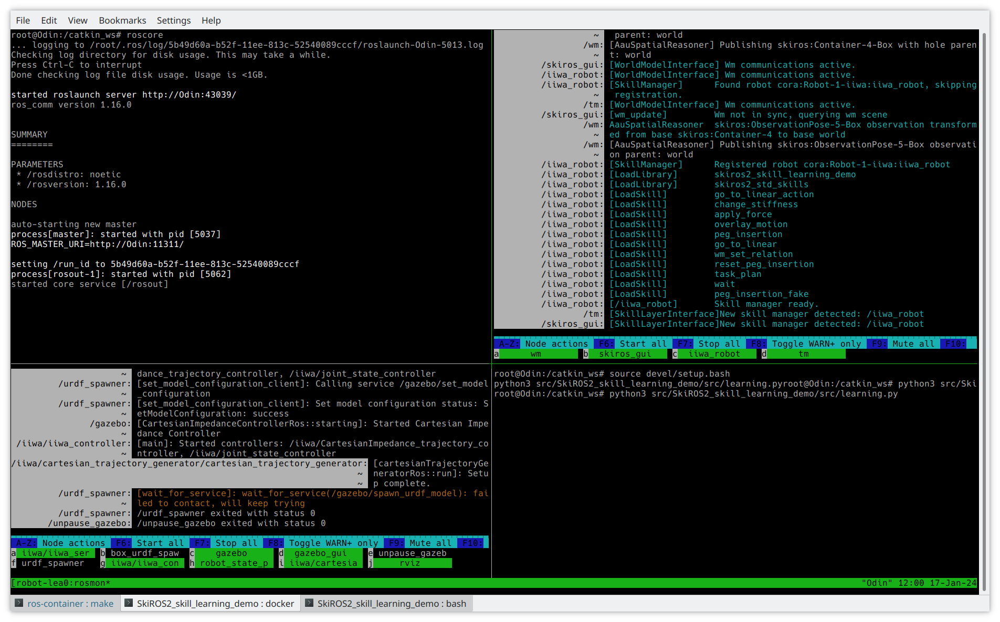
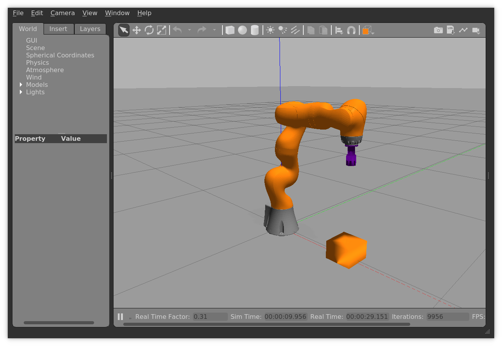
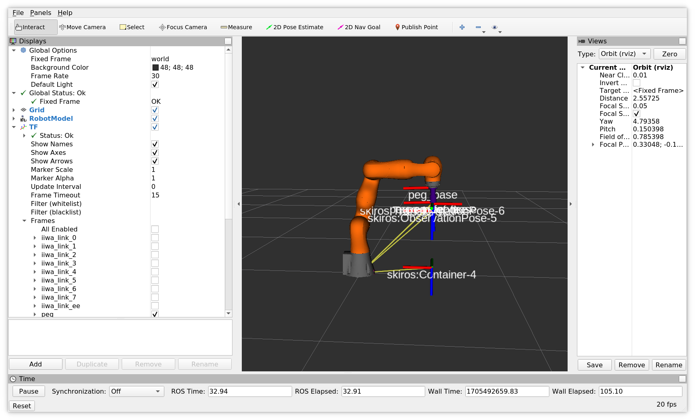
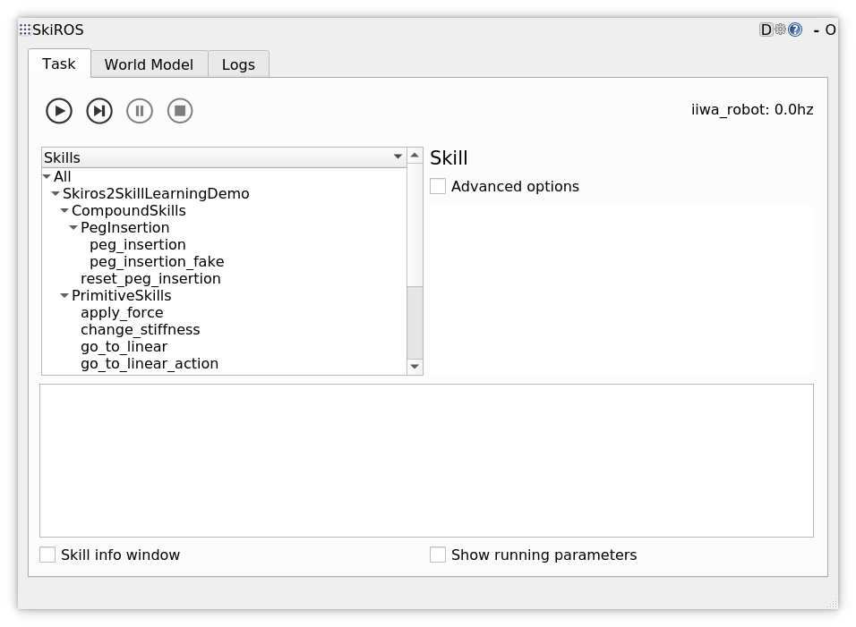
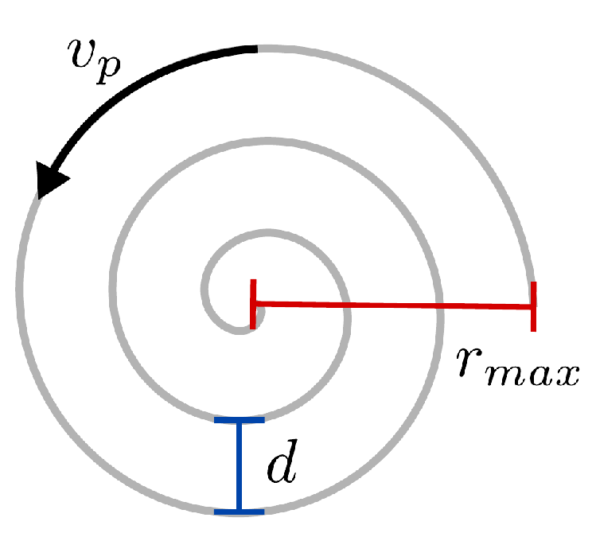
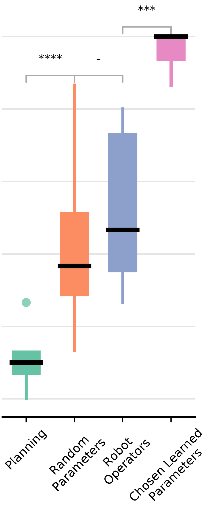
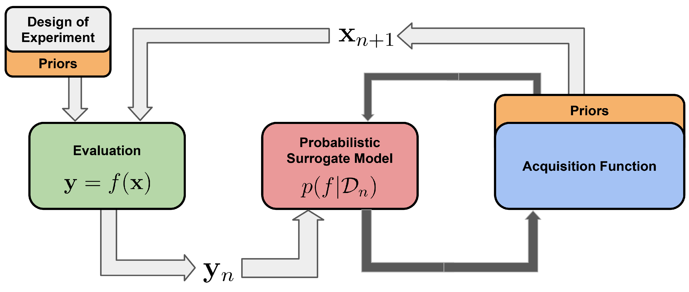
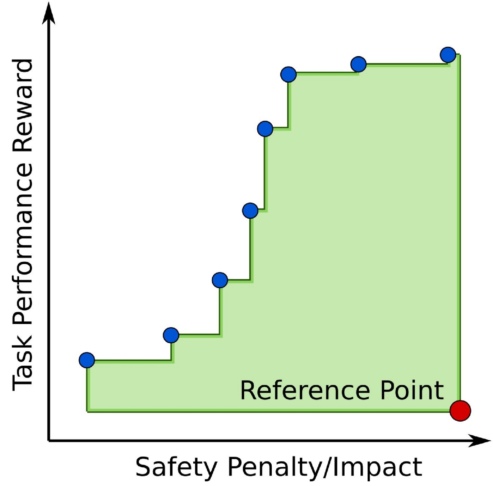

# SkiROS2_skill_learning_demo
A demo to learn a contact-rich task with SkiROS2 skills.

This repository contains a set of different things:
* The setup for the peg-insertion-skill-learning demo
* The robot setup with a KUKA iiwa
* SkiROS2 skills for a peg insertion
* Scripts for learning and plotting

Before jumping right into it, it can be worthwhile to learn a bit about [SkiROS2](https://github.com/RVMI/skiros2).

* **A full introduction and the tutorials are located in the SkiROS2 [wiki](https://github.com/RVMI/skiros2/wiki)**
* Executable skill examples are in the [skiros2_examples repository](https://github.com/RVMI/skiros2_examples) which is also included in this setup
* The [SkiROS2 paper](https://ieeexplore.ieee.org/abstract/document/10342216) ([arXiv](https://arxiv.org/abs/2306.17030)) provides an overview and background information
* The [skiros2_template_lib](https://github.com/RVMI/skiros2_template_lib) provides a skeleton for new skill  library

##  Installation and Setup
### Bare Metal
This assumes that you already have ROS noetic installed:
```
mkdir -p ~/catkin_ws/src
cd ~/catkin_ws
catkin init && catkin build
git clone https://github.com/matthias-mayr/SkiROS2_skill_learning_demo.git
SkiROS2_skill_learning_demo/scripts/installation.sh ~/catkin_ws
catkin build
source devel/setup.bash
```
### Docker

Pull the docker container with:
```sh
docker pull matthiasmayr/skiros2_skill_learning_demo:main
```

The run command is extended, so we can spawn graphical windows for the demo:
```sh
docker run --rm -it \
    --device=/dev/dri:/dev/dri \
    --ipc=host \
    --net=host \
    --privileged \
    --env DISPLAY=$DISPLAY \
    --volume="/tmp/.X11-unix:/tmp/.X11-unix:rw" \
    --volume ~/.Xauthority:/root/.Xauthority
    matthiasmayr/skiros2_skill_learning_demo:main
```

## Startup
### Startup Script
There is a startup script based on *tmux* in the scripts folder. It can be executed with
```sh
rosrun skiros2_skill_learning_demo startup_tmux.sh 
```


### Manual Startup
Launch the robot setup with
```sh
mon launch skiros2_skill_learning_demo robot.launch
```

Launch SkiROS2 with 
```sh
mon launch skiros2_skill_learning_demo skiros.launch
```
### Expected Outcome
You should see Gazebo, RViz and the SkiROS GUI:





## Planning

The peg insertion skill and the goto skill can be used for planning. To do that, select the skill `task_plan` and add the following planning goal:
```
(skiros:at skiros:Product-3 skiros:Container-4)
```

You will see the robot planner being engaged and the robot execute the plan.
# Learning
This demo learns good parameter sets for the peg insertion using [Bayesian optimization](https://en.wikipedia.org/wiki/Bayesian_optimization) with the tool [hypermapper](https://github.com/luinardi/hypermapper).

The peg insertion skills has parameters for the applied force and the spiral motion that can be learned:
```python
class PegInsertion(SkillDescription):
    def createDescription(self):
        #=======Params=========
        self.addParam("ObservationPose", Element("skiros:ObservationPose"), ParamTypes.Inferred)
        self.addParam("Arm", Element("rparts:ArmDevice"), ParamTypes.Required)
        self.addParam("Container", Element("skiros:Container"), ParamTypes.Required)
        self.addParam("Object", Element("skiros:Product"), ParamTypes.Required)
        self.addParam("Force", 4.0, ParamTypes.Required)
        self.addParam("Radius", 0.03, ParamTypes.Optional)
        self.addParam("PathVelocity", 0.1, ParamTypes.Optional)
        self.addParam("PathDistance", 0.01, ParamTypes.Optional)
```
They correspond to the pressure that is applied with the end effector and the parameters of the spiral search motion:



In principal we could select the `peg_insertion` skill in the SkiROS2 GUI, enter parameter values and observe the outcome.  
However, good values for these four parameters strongly depend on each other. In our [SkiREIL paper](https://ieeexplore.ieee.org/document/10011996) we had roboticists in the lab to parameterize a simpler version of this skill and they were barely better than random parameters:




So we are formulating this as a learning task with Bayesian optimization (BO). A loop typically looks like this:



The steps are the following:

1. Start out with an initial *Design of Experiment*-phase to get to know the search space
1. Evaluate these parameter configurations. In our case this means running the simulation and assessing the rewards
1. Build up a probabilistic surrogate model that models the behavior of our system. So in our example, how much reward the parameter configurations get
1. An acquisition function uses the surrogate model to decide upon the next best parameter configuration to evaluate. This is a trade off between exploration and exploitation: We want to efficiently search the space, because there might be better configurations out there, but we also want to exploit the best configurations that we have found so far.
1. The next best parameter configuration is evaluated and we update the surrogate model with the new information.

Additionally, methods like [piBO](https://openreview.net/forum?id=MMAeCXIa89) allow us to inject priors for the optimum. So if we already have a good idea of the search space and possible good parameter configurations, we can use this information to speed up the search. We evaluate this in the paper [Learning Skill-based Industrial Robot Tasks with User Priors](https://ieeexplore.ieee.org/document/9926713). The orange blocks indicate where we inject the priors.

The file [learning.py](src/learning.py) sets up such a loop with SkiROS2. It defines reward functions and calls the *peg_insertion* skill with different parameter configurations.

## Multi-Objective Learning
In many learning problems with industrial robots, we have multiple objectives. For example, we want to insert the peg as fast as possible, but also with as little force as possible. hypermapper allows us to define multiple objectives and it will then try to find a good trade-off between them.

In [learning.py](src/learning.py) we define two reward functions to calculate the force reward and a performance reward that depends on the distance to the goal. The latter also indirectly encourages the robot to insert the peg as fast as possible since that allows is to get closer to the goal faster.

The outcome of a multi-objective optimization is a set of Pareto-optimal solutions. These are solutions that cannot be improved in one objective without worsening the other:



## Specifying the Learning Problem

hypermapper uses a json file to specify the learning problem. In our case, we want to learn the parameters for the peg insertion skill. The file [peg_learning.json](config/peg_learning.json) specifies the search space, the objectives and the search configuration.

Here is an excerpt:
```json
    "application_name": "peg_learning",
    "optimization_objectives": ["force", "performance"],
    "optimization_iterations": 60,
    "input_parameters" : {
        "Force": {
            "parameter_type" : "real",
            "values" : [0.05, 20],
            "parameter_default" : 0.05
        },
    [...]
```

hypermapper has many more options that are documented in the [hypermapper wiki](https://github.com/luinardi/hypermapper/wiki/Json-Parameters-File).

## Running the Learning

To run the learning, execute
```sh
rosrun skiros2_skill_learning_demo learning.py
```

You'd see it executing the different parameter sets, starting with the *Design of Experiment* phase and continuing with the Bayesian optimization loop.

## Learning Results

In the same folder from which you executed the learning script, you will find the hypermapper log file and more importantlty the results csv file. It contains the results of the learning. The file *peg_learning_output_samples.csv* contains the parameter configurations and the rewards.

The Pareto-optimal points can be identified with the following command:
```sh
~/.local/bin/hm-compute-pareto /catkin_ws/src/SkiROS2_skill_learning_demo/config/peg_learning.json
# and plotted with
~/.local/bin/hm-plot-pareto /catkin_ws/src/SkiROS2_skill_learning_demo/config/peg_learning.json
```
It will create a csv file with the Pareto-optimal parameter sets and also `peg_learning_output_pareto.pdf` that contains a plot the Pareto-optimal points. To view it, one can for example use the lightweight `mupdf` viewer:
```sh
apt install mupdf
mupdf peg_learning_output_pareto.pdf
```

# Next Steps
If this gained your interest, you can learn more about learning with skills in these paper:
* The [SkiROS2 paper](https://ieeexplore.ieee.org/abstract/document/10342216) ([arXiv](https://arxiv.org/abs/2306.17030)) provides a SkiROS2 overview and background information
* [Skill-based Multi-objective Reinforcement Learning of Industrial Robot Tasks with Planning and Knowledge Integration](https://ieeexplore.ieee.org/document/10011996)
* [Learning Skill-based Industrial Robot Tasks with User Priors](https://ieeexplore.ieee.org/document/9926713)
* [Learning to Adapt the Parameters of Behavior Trees and Motion Generators (BTMGs) to Task Variations](https://ieeexplore.ieee.org/document/10341636)


The dissertation *Learning with Skill-based Robot Systems* includes the papers and provides a more comprehensive overview. It is [available here](https://portal.research.lu.se/en/publications/learning-with-skill-based-robot-systems-combining-planning-amp-kn).

Furthermore:

* You can check out the code behind the above-mentioned papers here: https://github.com/matthias-mayr/SkiREIL
* Our latest submission **BeBOP** uses learning an planning to create reactive behavior trees for industrial robots. The [code is here](https://github.com/jstyrud/BeBOP) and the [paper is available here](https://arxiv.org/abs/2310.00971).
* For general robot deliberation resources, there is an [awesome list](https://github.com/ros-wg-delib/awesome-ros-deliberation).
* More info about SkiROS is available in the [SkiROS2 repo](https://github.com/RVMI/skiros2). There is also always [the SkiROS2 paper](https://ieeexplore.ieee.org/abstract/document/10342216).


# Troubleshooting

## After the start, the robot goes into an upright position

This demo uses a Gazebo spawn function to set the initial joint configuration. Unfortunately this spawn function is a bit flawed and does not always work correctly.  
If you restart the robot bringup, it's most likely okay.